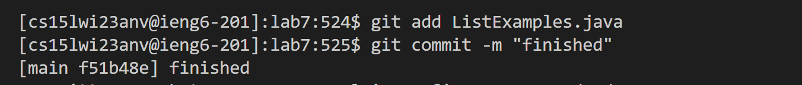

step 4: 
 
ssh cs15wi23anv@ieng6.ucsd.edu


step 5: 
  git clone ```<ctrl+v>```
  
  the ```<ctrl + v>``` keyboard shortcut allowed me to copy the repository link making it easier to clone. 
  
   
  
step 6: 
  cd lab7
  ```<Ctrl + v>``` 
  ```<Ctrl + v>``` T```<tab><backspace>```
  
  The ctrl v keyboard shortcut helped me copy the compiler command and the run command from the previos labs. 
  I had to type out the file to run and I used the tab key to auto finish the file and the extension so that I don't have to type it out.
  
    
  
Step 7: nano L```<tab> j<tab>```
         
        I pressed the down key <down> key once in the terminal till I reached the line with a bug on it. Then I pressed the <Right Arrow> key till my cursor was over the thing I wanted to edit then I pressed 2 which would fix the bug.
        ```<Ctrl + x>```
        ```<y>```
        ```<enter>```
         


Step 8: ```<Ctrl +r> <up <up> <up>```
        ```<enter>```
        I pressed the ctrl + r shourtcut to search previous commands and pressing up 3 times allowed me to find the correct compile command I previously ran.
        
        ```<Ctrl +r> <up> <up> <up> <up> <up>```
        ```<enter>```
        I pressed the ctrl + r shourtcut to search previous commands and pressing up 3 times allowed me to find the correct run command I previously ran.
         
          
Step 9: git add L```<tab> j<tab>```
        git commit -m "finished"
        git push 
       
         
          

     
  
        
  
The commands I ran that helped me the most are the ctrl + r that allows me to search the terminal for any previous commands. This saved me a lot of time. Before I was switching back to my browser and recopying the command posted in lab 3. With this new shortcut I can just go up to the previous time I ran the command and copy it. The tab command is also very useful as it lets me auto complete the sentence. 
